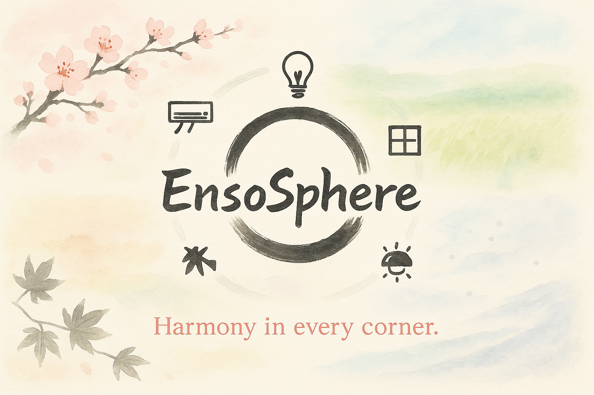

# 🧿 EnsoSphere - Smart Apartment IoT Simulation

> *“A circle has no beginning or end. Like time. Like energy. Like a home that breathes and responds.”*  
> *Inspired by the Zen concept of Ensō (円相), symbolizing harmony, completeness, and simplicity in complexity.*



---

Welcome to **EnsoSphere** – a fully simulated smart apartment IoT system built with modularity, automation, and seasonal awareness in mind.  
This project replicates realistic daily behavior in a modern, 5.5-room apartment using sensors, actuators, and MQTT messaging in a dynamic environment.

---

## 🎯 Project Objectives

- Simulate **daily routines** for all four seasons (Winter, Spring, Summer, Autumn).
- Implement a fully **modular architecture** with pluggable sensors and devices.
- Build an **MQTT-based communication system** to reflect real IoT behavior.
- Automate apartment behavior using a **rule engine** driven by sensor input.
- Provide full **technical event logs** for every season.
- (Optional) Add a **visual dashboard** to display real-time system status.

---

## 🧠 Key Features

- 🌦️ Simulated time, daylight cycles, seasons, and weather.
- 🧩 Configurable rule engine (via JSON).
- 🧱 Independent sensor/device simulation with MQTT communication.
- 📆 Seasonal Excel routines simulate human-like behavior.
- 📊 Full logging of system events per season.
- 📁 Documented and extensible folder structure.

---

## 🧰 Technologies Used

| Category       | Library/Tool        |
|----------------|---------------------|
| Language       | Python 3.x          |
| Messaging      | MQTT (`paho-mqtt`)  |
| Data Handling  | `pandas`, `openpyxl`, `json` |
| Time Engine    | `datetime`, custom simulation |
| Logging        | `logging` (custom)  |
| Optional GUI   | `dashboard.py` (custom) |
| Docs & Diagrams| Markdown + Visuals  |

---

## 📂 Project Structure

```bash
EnsoSphere/
├── main.py
├── config.yaml
├── core/
│   ├── environment_manager.py
│   ├── mqtt_client.py
│   ├── rule_engine.py
│   └── scheduler.py
├── managers/
│   ├── device_manager.py
│   ├── sensor_manager.py
│   └── rule_manager.py
├── devices/
├── sensors/
├── rules/
│   ├── rule_schema.json
│   └── default_rules.json
├── data/
├── routines/
│   ├── Daily_routine_Winter_IoT.xlsx
│   ├── Daily_routine_Spring_IoT.xlsx
│   ├── Daily_routine_Summer_IoT.xlsx
│   └── Daily_routine_Autumn_IoT.xlsx
├── logs/
│   ├── Winter - Technical_Event_Table.csv
│   ├── Spring - Full Technical Event Table.xlsx
│   ├── Summer - Full Technical Event Table.xlsx
│   └── Autumn - Full Technical Event Table.xlsx
├── docs/
│   ├── Smart_Apartment_Full_Report.md
│   ├── Smart_Apartment_Project_Plan_With_TODO.md
│   ├── Smart_Apartment_Folder_Structure_and_Guide.md
│   ├── Smart_Apartment_Full_Project_Summary.md
├── dashboard/
│   └── dashboard.py
├── utils/
├── assets/
│   └── Final_Cover.PNG
└── README.md
```

---

## 📅 Seasonal Simulation Logic

- **Winter ❄️**: Emphasizes heating, early sunsets, and indoor lighting.
- **Summer ☀️**: Blinds and cooling are dominant; sensors adjust to heat.
- **Spring 🌼**: Balanced behavior; more open-air and mixed conditions.
- **Autumn 🍂**: Transition period with alternating heating/cooling logic.

---

## 🔁 System Flow Diagram

```text
1. Environment updates time, season, and weather
2. Sensors collect data and publish via MQTT
3. SensorManager processes readings and stores values
4. RuleEngine evaluates rules based on sensor input
5. Matching rules send commands to DeviceManager
6. Devices act and log changes
7. Dashboard (optional) reflects system state in real-time
```

---

## 📋 Getting Started

```bash
# 1. Clone the repo
git clone https://github.com/your-username/EnsoSphere.git
cd EnsoSphere

# 2. Install dependencies
pip install -r requirements.txt

# 3. Run the simulation
python main.py
```

---

## 📘 Documentation & Resources

📁 `docs/` contains:
- Full device & room breakdown
- Folder structure explanation
- Project plan with TODOs
- Project summary and MQTT examples

📁 `routines/` contains:
- Excel-based seasonal human routines

📁 `logs/` contains:
- System event logs mapped from routines

---

## 🌀 Why "EnsoSphere"?

The word **Ensō (円相)** in Zen Buddhism represents the cycle of life, the beauty of imperfection, and the interconnectedness of systems.  
Just like our apartment: always flowing, always reacting, always complete – yet always evolving.

---

## 🧩 Contributions

Feel free to fork, open issues, or suggest ideas. This project thrives on clean modularity and creative expansion!

---

## 📜 License

MIT License

---

## 🙏 Acknowledgments

Built with ❤️ and Python.  
Inspired by nature, automation, and the elegant imperfection of smart living.