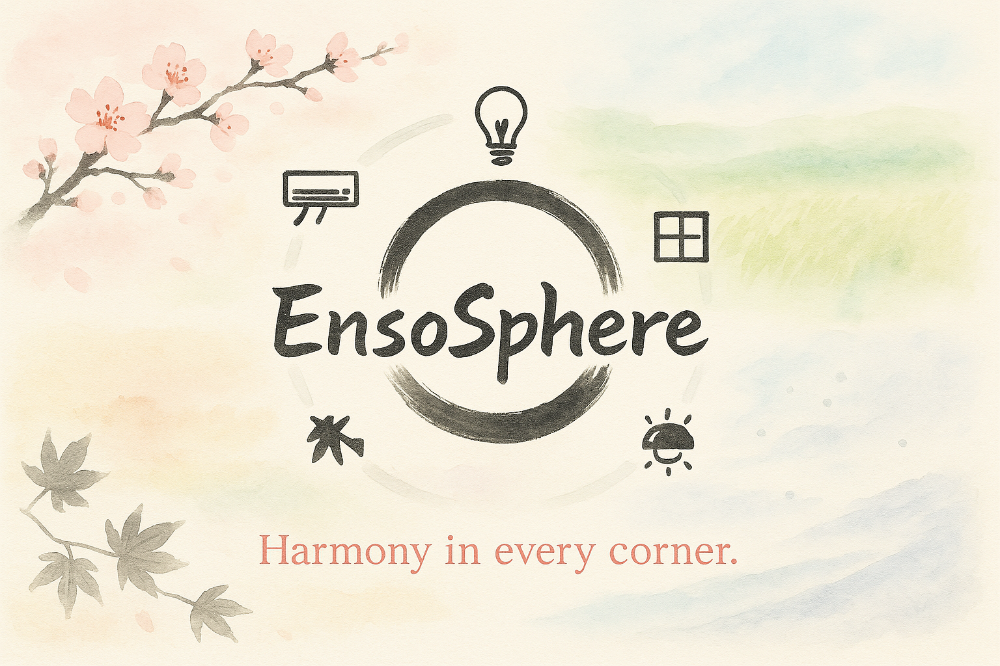

# 🧿 EnsoSphere - Smart Apartment IoT Simulation (Full Architecture)

> *“A circle has no beginning or end. Like time. Like energy. Like a home that breathes and responds.”*  
> *Inspired by the Zen concept of Ensō (円相), symbolizing harmony, completeness, and simplicity in complexity.*



---

Welcome to **EnsoSphere** – a fully modular, database-driven smart apartment IoT system simulation. This project captures realistic seasonal routines and home automation through time-synchronized data ticks, device control, and rule-based decision-making.

---

## 🎯 Project Objectives

- Simulate daily routines across **four seasons** with environmental logic.
- Design a **time-accelerated simulation engine** with realistic weather, daylight, and occupant behavior.
- Implement a **modular rule engine** driven by simulated sensors.
- Use **SQLite** for consistent, replayable, and debug-friendly tick storage.
- Use **MQTT** to model real-world IoT message flow.
- Add a **WebUI** dashboard for real-time visualization.

---

## 🧱 System Architecture – Core Containers

| Container       | Role                                               |
|----------------|----------------------------------------------------|
| `simulator`     | Generates `state_json` ticks (occupants, weather) |
| `corelogic`     | Sensor → Rule → Device engine (with MQTT output) |
| `webui`         | React dashboard to visualize current state        |
| `mosquitto`     | MQTT broker for device messaging                  |
| `sqlite`        | System database and tick-based state repository  |

---

## 🔁 Tick-Based Flow (Every Cycle)

1. **Simulator** writes `state_json` ➝ `state_raw`
2. **CoreLogic** pulls unprocessed tick ➝ computes sensors ➝ evaluates rules ➝ updates `device_states`
3. **WebUI** renders latest processed snapshot by `state_id`

> Data flow is strictly based on `state_id`, ensuring each tick is complete and consistent across all components.

---

## 🔧 Technologies Used

| Category       | Library/Tool        |
|----------------|---------------------|
| Language       | Python 3.x, JavaScript (React) |
| Messaging      | MQTT (`paho-mqtt`, Mosquitto)  |
| Database       | SQLite               |
| Time Engine    | Accelerated custom time engine |
| Web Frontend   | React + Tailwind or Bootstrap  |
| Scheduler      | `apscheduler`, `asyncio`, `sqlite3` |

---

## 📦 Component Inventory

### 🟦 Sensor Modules (Simulated Inputs)

| Sensor ID               | Type               | Description                           |
|------------------------|--------------------|---------------------------------------|
| `motion_sensor`        | Motion             | Detects movement in rooms             |
| `gas_sensor`           | Gas                | Detects gas levels or leaks           |
| `humidity_sensor`      | Humidity           | Measures humidity level               |
| `temperature_sensor`   | Temperature        | Measures room temperature             |
| `noise_sensor`         | Noise              | Measures sound levels (e.g. barking)  |
| `weather_sensor`       | Weather            | Provides current weather condition    |
| `door_main_sensor`     | Door Contact       | Detects if main door is open/closed   |
| `pet_near_door_sensor` | Pet Proximity      | Detects Luna near the front door      |
| `no_motion_all_rooms`  | Logical            | True if no motion detected anywhere   |

### 🟩 Actuator Modules (Devices)

| Device ID              | Type             | Description                            |
|------------------------|------------------|----------------------------------------|
| `air_conditioner`      | Air Conditioner  | Controls cooling system                |
| `audio_system`         | Audio System     | Controls music/audio playback          |
| `blinds`               | Blinds           | Opens/closes blinds in rooms           |
| `door_lock`            | Door Lock        | Controls main door lock/unlock         |
| `door_pet`             | Pet Door         | Smart door for pet access              |
| `lights`               | Lights           | Turns lights on/off                    |
| `pet_feeder`           | Feeder           | Dispenses food for Luna                |
| `robot_vacuum`         | Robot Vacuum     | Cleans floor when house is empty       |
| `security_system`      | Security         | Controls alarm/security mode           |
| `tv_living_room`       | TV               | Controls living room television        |
| `ventilation_fan`      | Ventilation Fan  | Adjusts airflow                        |
| `window`               | Smart Window     | Opens/closes based on weather          |

---

## 🧠 Rule Engine (CoreLogic)
- Rules are stored in JSON (e.g. `rules.json`)
- Each rule includes conditions (`sensor` or `env`) and actions (`device_id`, `command`)
- Triggered rules are logged into `rule_triggers`

### Sample Rule:
```json
{
  "rule_id": "lights_auto_kitchen",
  "trigger": {
    "all": [
      {"sensor": "motion_kitchen", "equals": true},
      {"env": "is_daytime", "equals": false}
    ]
  },
  "actions": [
    {"device": "lights_kitchen", "command": {"status": "on"} }
  ]
}
```

---

## 🧾 SQLite Structure – Core Tables

| Table            | Description                           |
|------------------|---------------------------------------|
| `state_raw`       | Raw state JSON from simulator         |
| `sensor_outputs`  | Calculated sensor states              |
| `rule_triggers`   | Rule evaluations per tick             |
| `device_states`   | Latest device states (updated live)   |

Each table uses `state_id` to ensure full traceability per tick.

---

## 🌐 WebUI Overview

- React-based live dashboard
- Polls DB every 3s for latest `state_id`
- Renders:
  - Occupants and their rooms
  - Weather, time, season
  - Devices and states
  - Rules triggered + sensors

---

## ⏱️ Synchronization Logic

| Component  | Interval     | Description                      |
|------------|--------------|----------------------------------|
| Simulator  | 1 sec        | Emits `state_json`               |
| CoreLogic  | 2 sec        | Processes new state if exists    |
| WebUI      | 3 sec        | Polls DB for latest snapshot     |

- All components work independently but are bound by `state_id`
- No shared memory – DB acts as the synchronization layer

---

## 📂 Folder Structure

```bash
EnsoSphere/
├── simulator/            # Simulated environment and time
├── corelogic/            # Rule engine, sensors, devices
├── webui/                # React dashboard
├── mqtt/                 # Mosquitto broker config
├── data/                 # SQLite DB + logs
├── rules/                # JSON rules
├── routines/             # Seasonal schedules (Excel)
├── docs/                 # Reports, plans, technical design
└── docker-compose.yml    # Service orchestration
```

---

## 📦 Getting Started

```bash
# 1. Clone the repository
https://github.com/your-username/EnsoSphere.git
cd EnsoSphere

# 2. Run the system using Docker
docker-compose up --build
```

---

## 👨‍💻 Created by: Itay Vazana

[GitHub Profile](https://github.com/ItayVazana1)  
[LinkedIn](https://www.linkedin.com/in/itayvazana)

---

## 🌀 Why "EnsoSphere"?
Ensō (円相) in Zen art is a circle drawn in a single breath — symbolizing perfection, fluidity, and interdependence.  
This project reflects that vision: a living, breathing system. Complete, yet dynamic.

---
